# Semi-supervised learning GAN in Tensorflow

As part of the implementation series of [Joseph Lim's group at USC](http://csail.mit.edu/~lim), our motivation is to accelerate (or sometimes delay) research in the AI community by promoting open-source projects. To this end, we implement state-of-the-art research papers, and publicly share them with concise reports. Please visit our [group github site](https://github.com/gitlimlab) for other projects.

This project is implemented by [Shao-Hua Sun](http://shaohua0116.github.io) and the codes have been reviewed by [Jiayuan Mao](https://github.com/vacancy) before being published.

## Descriptions
This project is a [Tensorflow](https://www.tensorflow.org/) implementation of **Semi-supervised Learning Generative Adversarial Networks** proposed in the paper [Improved Techniques for Training GANs](http://arxiv.org/abs/1606.03498). The intuition is exploiting the samples generated by GAN generators to boost the performance of image classification tasks by improving generalization.

In sum, **the main idea** is training a network playing both the roles of a *classifier* performing image classification task as well as a *discriminator* trained to distinguish generated samples produced by a *generator* from the real data. To be more specific, the discriminator/classifier takes an image as input and classified it into *n+1* classes, where *n* is the number of classes of a classification task. True samples are classified into the first *n* classes and generated samples are classified into the *n+1*-th class, as shown in the figure below.

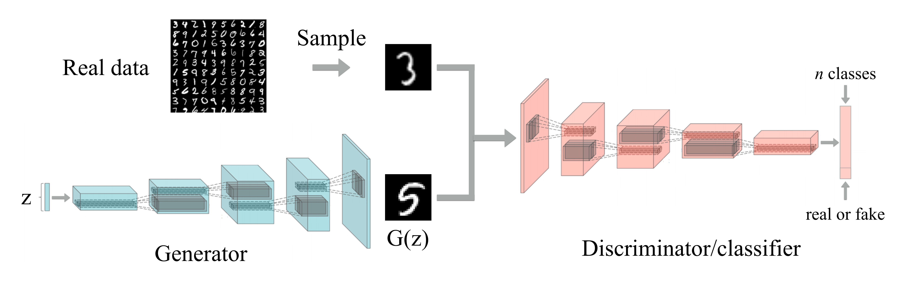

The loss of this multi-task learning framework can be decomposed into the **supervised loss** 

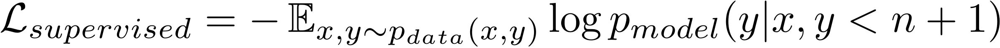, 

and the **GAN loss** of a discriminator

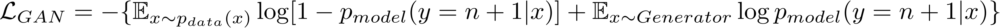, 

During the training phase, we jointly minimize the total loss obtained by simply combining the two losses together.

The implemented model is trained and tested on three publicly available datasets: [MNIST](http://yann.lecun.com/exdb/mnist/), [SVHN](http://ufldl.stanford.edu/housenumbers/), and [CIFAR-10](https://www.cs.toronto.edu/~kriz/cifar.html).

Note that this implementation only follows the main idea of the original paper while differing a lot in implementation details such as model architectures, hyperparameters, applied optimizer, etc. Also, some useful training tricks applied to this implementation are stated at the end of this README.

\*This code is still being developed and subject to change.

## Prerequisites

- Python 2.7 or Python 3.3+
- [Tensorflow 1.0.0](https://github.com/tensorflow/tensorflow/tree/r1.0)
- [SciPy](http://www.scipy.org/install.html)
- [NumPy](http://www.numpy.org/)

## Usage

Download datasets with:
```bash
$ python download.py --dataset MNIST SVHN CIFAR10
```
Train models with downloaded datasets:
```bash
$ python trainer.py --dataset MNIST
$ python trainer.py --dataset SVHN
$ python trainer.py --dataset CIFAR10
```
Test models with saved checkpoints:
```bash
$ python evaler.py --dataset MNIST --checkpoint ckpt_dir
$ python evaler.py --dataset SVHN --checkpoint ckpt_dir
$ python evaler.py --dataset CIFAR10 --checkpoint ckpt_dir
```
The *ckpt_dir* should be like: ```train_dir/default-MNIST_lr_0.0001_update_G5_D1-20170101-194957/model-1001```

Train and test your own datasets:

* Create a directory
```bash
$ mkdir datasets/YOUR_DATASET
```

* Store your data as an h5py file datasets/YOUR_DATASET/data.hy and each data point contains
    * 'image': has shape [h, w, c], where c is the number of channels (grayscale images: 1, color images: 3)
    * 'label': represented as an one-hot vector
* Maintain a list datasets/YOUR_DATASET/id.txt listing ids of all data points
* Modify trainer.py including args, data_info, etc.
* Finally, train and test models:
```bash
$ python trainer.py --dataset YOUR_DATASET
$ python evaler.py --dataset YOUR_DATASET
```
## Results

### MNIST

* Generated samples (100th epochs)

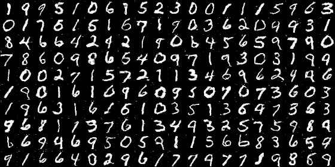

* First 40 epochs

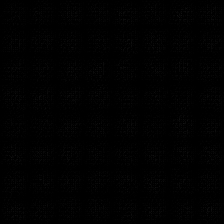

### SVHN

* Generated samples (100th epochs)

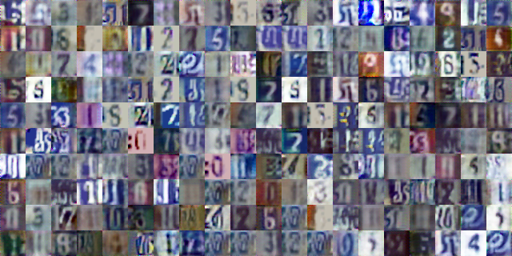

* First 160 epochs


### CIFAR-10

* Generated samples (1000th epochs)

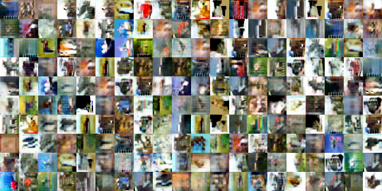

* First 200 epochs


## Training details

### MNIST

* The supervised loss

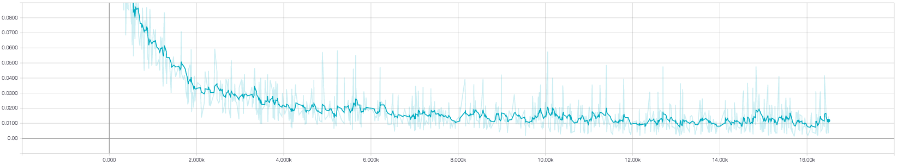

* The loss of Discriminator

D_loss_real

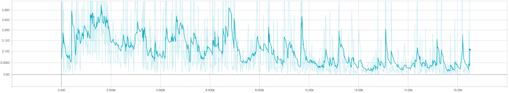

D_loss_fake

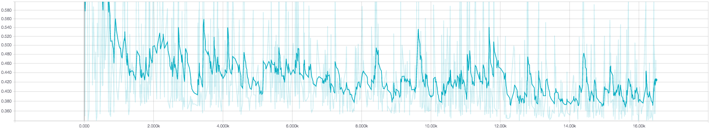

D_loss (total loss)

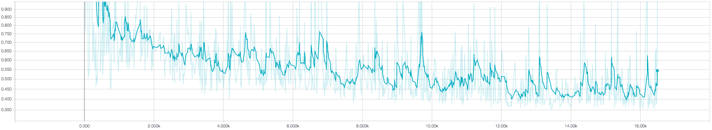

* The loss of Generator

G_loss

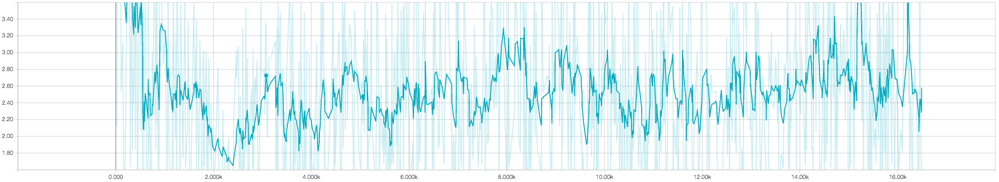

* Classification accuracy

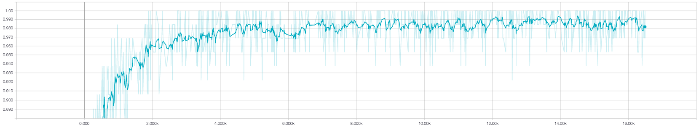

### SVHN

* The supervised loss

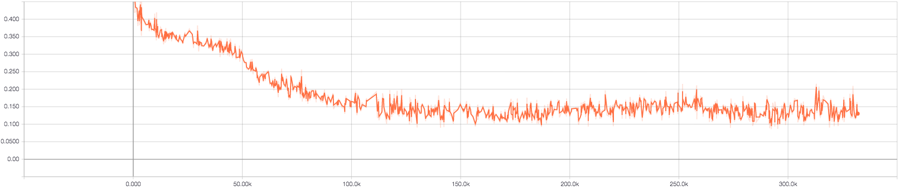

* The loss of Discriminator

D_loss_real

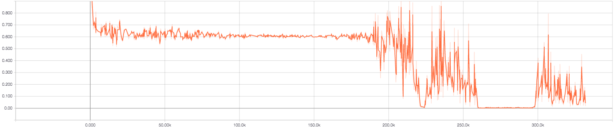

D_loss_fake

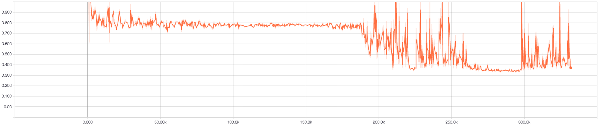

D_loss (total loss)

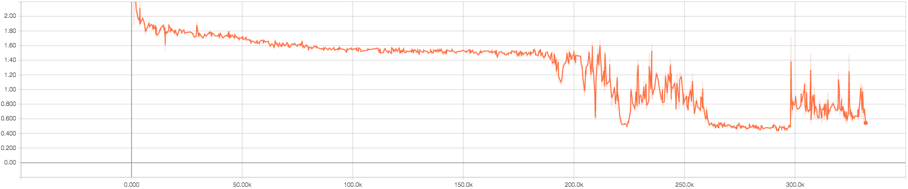

* The loss of Generator

G_loss

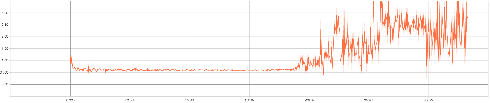

* Classification accuracy

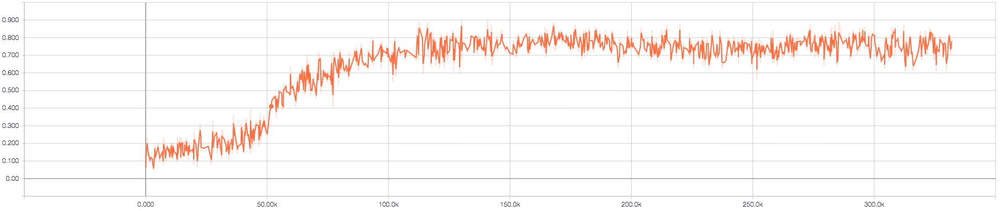

### CIFAR-10

* The supervised loss

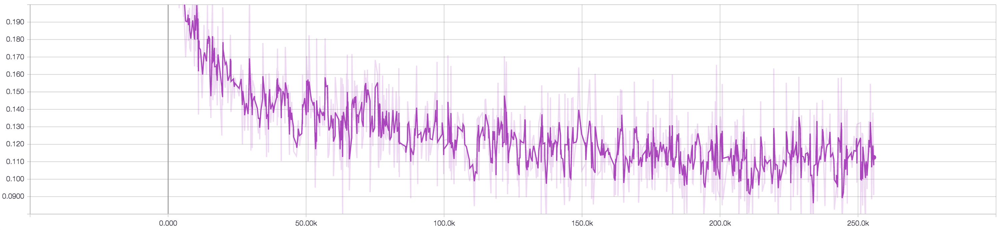

* The loss of Discriminator

D_loss_real

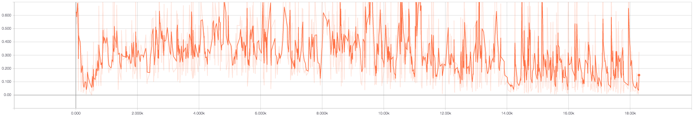

D_loss_fake

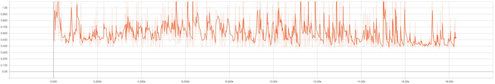

D_loss (total loss)

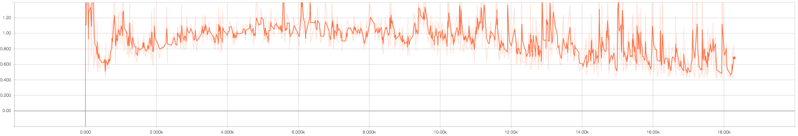

* The loss of Generator

G_loss


* Classification accuracy

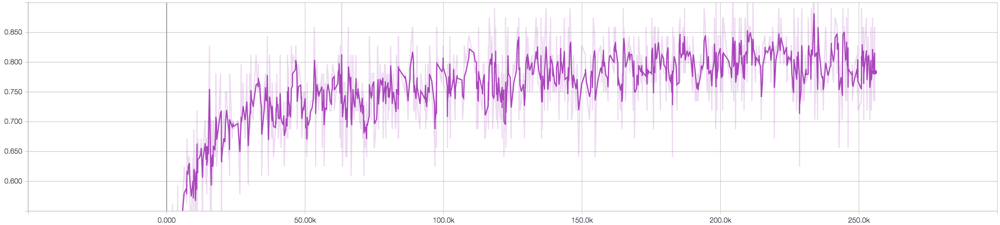

## Training tricks

* To avoid the fast convergence of the discriminator network
    * The generator network is updated more frequently.
    * Higher learning rate is applied to the training of the generator.
* One-sided label smoothing is applied to the positive labels.
* Gradient clipping trick is applied to stablize training
* Reconstruction loss with an annealed weight is applied as an auxiliary loss to help the generator get rid of the initial local minimum.
* Utilize [Adam](https://arxiv.org/abs/1412.6980) optimizer with higher momentum.
* Please refer to the codes for more details.

## Related works
* [Unsupervised and Semi-supervised Learning with Categorical Generative Adversarial Networks](https://arxiv.org/abs/1511.06390) by Springenberg
* [Semi-Supervised Learning with Generative Adversarial Networks](https://arxiv.org/abs/1606.01583) by Odena
* [Good Semi-supervised Learning that Requires a Bad GAN](https://arxiv.org/abs/1705.09783) by Dai *et. al.*
* My implementation of [Deep Convolutional Generative Adversarial Networks](https://github.com/shaohua0116/DCGAN-Tensorflow) in Tensorflow
* The architecture diagram is modified from the one drawn in [Unsupervised Representation Learning with Deep Convolutional Generative Adversarial Networks](https://arxiv.org/abs/1511.06434)

## Acknowledgement

Part of codes is from an unpublished project with [Jongwook Choi](https://github.com/wookayin)
