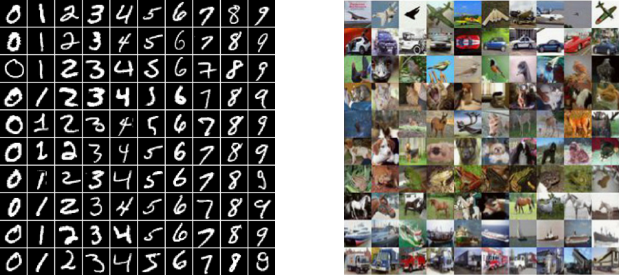

# Semi-supervised learning GAN in Tensorflow

## Descriptions
This is my [Tensorflow](https://www.tensorflow.org/) implementation of **Semi-supervised Learning Generative Adversarial Networks** proposed in the paper [Improved Techniques for Training GANs](http://arxiv.org/abs/1606.03498). The goal of this work is exploiting the samples generated by GAN generators to boost the performance of image classification tasks by improving generalization.

In sum, **the main idea** is training a network playing the roles of both a classifier performing image classification task as well as a discriminator trained to distinguish samples from the generator distribution from real data. To be more specific, the classifier/discriminator takes an image as input and classified it into *n+1* class, where *n* is the number of classes of a classification task. True samples are classified into the first *n* classes and generated samples are classified into the *n+1*-th class. 

The loss of this multi-task learning framework can be decomposed into the **supervised loss** 

, 

and the **GAN loss** of a discriminator

, 

During the training phase, we jointly minimize the total loss obtained by simply combining the two losses together.

Note that this implementation only follows the main idea of the original paper while differing a lot in implementation details such as model architectures, hyperparameters, applied optimizer, etc. Also, some useful training tricks applied to this implementation are stated at the end of this README.

.

## Prerequisites

- Python 2.7 or Python 3.3+
- [Tensorflow 1.0.0](https://github.com/tensorflow/tensorflow/tree/r1.0)
- [SciPy](http://www.scipy.org/install.html)
- [NumPy](http://www.numpy.org/)

## Usage

Download datasets with:

    $ python download.py --dataset mnist cifar

To train a model with downloaded dataset:

    $ python trainer.py --dataset mnist
    $ python trainer.py --dataset cifar

To test with an existing model:

    $ python evaler.py --dataset mnist --checkpoint ckpt_dir
    $ python evaler.py --dataset cifar --checkpoint ckpt_dir

To train and test your own datasets:

    $ mkdir datasets/YOUR_DATASET
    ... format your data to datasets/YOUR_DATASET ...
    ... add a data loading file datasets/YOUR_DATASET.py ...
    $ python trainer.py --dataset YOUR_DATASET --input_height h --input_width w --num_class c
    $ python evaler.py --dataset YOUR_DATASET --input_height h --input_width w --num_class c

## Results

### MNIST

### CIFAR10

## Training details

Details of the loss of Discriminator and Generator.

Details of the histogram of real and fake results of Discriminator.

## Training tricks

* To avoid the fast convergence of D (discriminator) network, G (generator) network is updated more frequently.
* One-sided label smoothing is applied to the positive labels.

## Related articles
* [Unsupervised and Semi-supervised Learning with Categorical Generative Adversarial Networks](https://arxiv.org/abs/1511.06390) by Springenberg
* [Semi-Supervised Learning with Generative Adversarial Networks](https://arxiv.org/abs/1606.01583) by Odena
* [Good Semi-supervised Learning that Requires a Bad GAN](https://arxiv.org/abs/1705.09783) by Dai *et. al.*

## Author

Shao-Hua Sun / [@shaohua0116](https://shaohua0116.github.io/)
